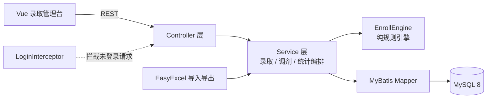
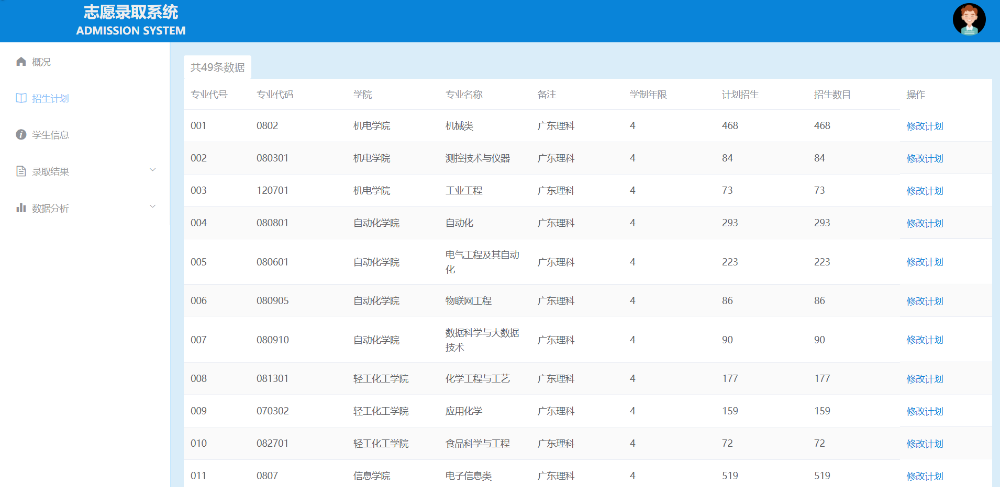
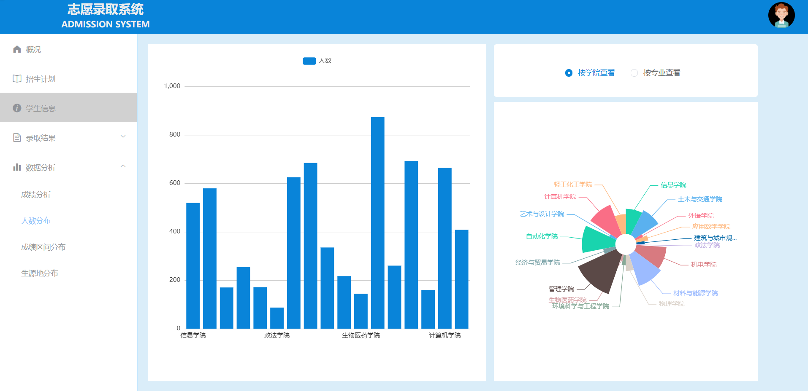
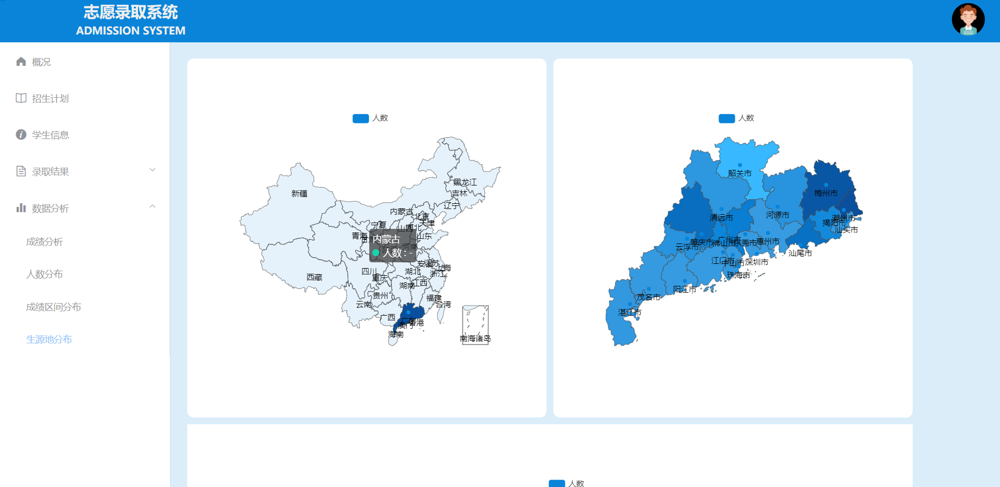
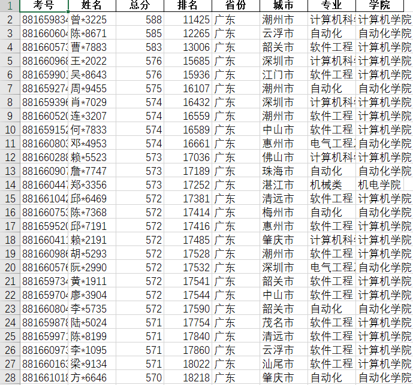

# 平行志愿录取系统

[](https://openjdk.org/)
[](https://spring.io/projects/spring-boot)
[](https://mybatis.org/)
[](https://www.mysql.com/)
[](https://vuejs.org/)

**把招生计划、考生志愿和录取结果放进同一条可追溯的业务链路。**

基于 Spring Boot + MyBatis + MySQL 的平行志愿投档系统，前端是 Vue 实现的录取管理台，
支持 Excel 批量导入、录取状态机、专业调剂、统计报表与结果导出。

[功能特性](#功能特性) · [系统架构](#系统架构) · [快速开始](#快速开始) · [接口文档](docs/api.md) · [数据模型](docs/data-model.md) · [测试与验证](#测试与验证) · [项目文档](#项目文档)

---

## 项目简介

平行志愿的核心规则是「分数优先、遵循志愿」。本项目把这条规则拆成三个部分：

- **数据准备**：招生计划 Excel 与考生志愿 Excel 通过 EasyExcel 批量导入，监听器按 20 条一批写入，避免大文件一次性占用内存。
- **投档与调剂**：按排位从高到低依次检索 6 个志愿，命中第一个仍有计划余额的专业即投档；全部落空的考生按是否服从调剂进入调剂池或退档。
- **结果交付**：录取结果与退档队列导出为 Excel，同时提供学院、专业、分数段、生源地维度的统计报表。

投档规则被抽取为独立的 `EnrollEngine`，不依赖 Spring 容器与数据库，因此可以用纯单元测试覆盖
「志愿命中、计划录满、顺延、调剂、退档」等全部分支；数据库读写仍由 MyBatis Mapper 承担。

## 功能特性

### 录取业务

- **招生计划管理**：按学院维护专业代号、专业代码、学制与招生计划数，支持计划数调整。
- **志愿数据导入**：导入 6 个院校专业志愿、总分、排位、省份、城市、科类与是否服从调剂。
- **平行志愿投档**：分数优先、遵循志愿，逐志愿检索计划余额，不会出现超录。
- **专业调剂**：把服从调剂且志愿落空的考生按排位补进缺额专业，缺额用完后剩余考生退档。
- **状态机约束**：录取与调剂必须按「起始 → 已导入计划 → 已导入志愿 → 已录取 → 已调剂」的顺序执行，跳步直接拒绝。

### 查询与统计

- 录取结果分页查询，支持按排位、学院、专业筛选与关键字检索。
- 学院 / 专业维度的最高分、最低分、最高排位、最低排位与平均分统计。
- 生源地分布、分数段分布、各学院与各专业录取人数分布。
- 退档队列与调剂队列单独查询，便于复核。

### 工程实现

- Druid 连接池、慢 SQL 统计与内置监控页；PageHelper 统一分页。
- 全局异常处理，业务校验失败返回 `001`，系统异常记录日志并返回 500。
- 登录拦截器基于 HttpSession 校验，登录成功后重建会话，避免会话固定问题。
- 建表脚本默认不自动执行；`schema.sql` 含 `DROP TABLE`，避免重启清空数据。
- 数据库账号密码、管理员账号全部通过环境变量注入，仓库不保存任何真实凭据。
- MySQL 8 + Docker Compose 一键启动，GitHub Actions 自动跑单元测试与集成测试。

## 系统架构



一次完整的录取链路：

1. `POST /file/uploadMajor` 导入招生计划，状态推进到「已导入计划」。
2. `POST /file/uploadStudent` 导入考生志愿，状态推进到「已导入志愿」。
3. `GET /student/doEnroll` 按排位分页读取考生，逐志愿投档并回写结果，状态推进到「已录取」。
4. `GET /student/doAdjust` 为服从调剂的考生补录缺额专业，状态推进到「已调剂」。
5. `GET /file/exportResult` 与 `GET /file/exportExit` 导出录取结果与退档队列。

## 技术栈

| 层次 | 技术 | 用途 |
| --- | --- | --- |
| 后端 | Spring Boot 2.7 / Spring MVC | 依赖注入、REST 接口、拦截器与全局异常处理 |
| 持久层 | MyBatis 2.2 / PageHelper | XML 映射、动态 SQL、分页查询 |
| 数据库 | MySQL 8.0 / Druid | 关系建模、连接池、慢 SQL 统计 |
| 表格处理 | EasyExcel 3.3 | 招生计划与志愿的批量导入、结果导出 |
| 前端 | Vue 2 / Element UI / ECharts | 管理台页面、表格与统计图表（已构建为静态资源） |
| 测试 | JUnit 5 / Spring Boot Test | 规则单元测试与 MySQL 端到端集成测试 |

## 界面预览

| 登录 | 录取结果表格 |
| --- | --- |
|  |  |

| 统计信息 | 生源地分布 |
| --- | --- |
|  |  |



## 快速开始

### 环境要求

- JDK 8 及以上（已在 JDK 17 上验证运行）
- Maven 3.6 及以上，或直接使用仓库自带的 `mvnw`
- MySQL 5.7 / 8.0（推荐 8.0）

### 1. 准备数据库

```sql
CREATE DATABASE db_enroll CHARACTER SET utf8mb4 COLLATE utf8mb4_general_ci;
```

首次初始化表结构时二选一：

- 手动执行 `sql/db_enroll.sql`；
- 首次启动时设置环境变量 `SQL_INIT_MODE=always`，让应用执行 `classpath:sql/schema.sql` 建表。

> `schema.sql` 会先 `DROP TABLE` 再建表。**不要**在已有数据的库上使用 `SQL_INIT_MODE=always`，
> 日常启动请保持默认的 `never`。

### 2. 配置环境变量

```powershell
$env:MYSQL_HOST     = "127.0.0.1"
$env:MYSQL_PORT     = "3306"
$env:MYSQL_DATABASE = "db_enroll"
$env:MYSQL_USER     = "root"
$env:MYSQL_PASSWORD = "<你的数据库密码>"
$env:ADMIN_NAME     = "admin"
$env:ADMIN_PASSWORD = "<后台管理员密码>"
$env:SQL_INIT_MODE  = "never"
$env:SERVER_PORT    = "8080"
```

| 变量 | 默认值 | 说明 |
| --- | --- | --- |
| `MYSQL_HOST` / `MYSQL_PORT` | `127.0.0.1` / `3306` | 数据库地址 |
| `MYSQL_DATABASE` | `db_enroll` | 数据库名 |
| `MYSQL_USER` / `MYSQL_PASSWORD` | `root` / 空 | 数据库账号 |
| `SQL_INIT_MODE` | `never` | 设为 `always` 时启动执行建表脚本 |
| `SERVER_PORT` | `8080` | 服务端口 |
| `LOGIN_ENABLED` | `true` | 是否开启登录校验 |
| `ADMIN_NAME` / `ADMIN_PASSWORD` | `admin` / `admin123` | 管理台账号，上线前必须修改 |
| `DRUID_CONSOLE_ENABLED` | `false` | 是否开启 Druid 监控页 |

### 3. 启动

Windows 一键启动（自动完成打包与启动）：

```powershell
pwsh -NoProfile -ExecutionPolicy Bypass -File tools/run-dev.ps1
```

或手动运行：

```bash
mvn clean package
java -jar target/parallel-volunteer-admission-system-1.0.0.jar
```

启动后访问 <http://127.0.0.1:8080/admission/index.html>，使用 `ADMIN_NAME` / `ADMIN_PASSWORD` 登录。

### 4. 使用流程

1. 登录管理台。
2. 上传招生计划文件（示例：`excel/广东某大学招生计划.xlsx`）。
3. 上传考生志愿文件（示例：`excel/平行志愿考生测试数据.xlsx`）。
4. 执行录取，等待状态变为「已录取」。
5. 执行专业调剂，状态变为「已调剂」。
6. 查看统计报表，或导出录取结果与退档队列。

## Docker 部署

```bash
docker compose up -d --build
```

Compose 会启动 MySQL 8（自动执行 `sql/db_enroll.sql` 建表）和应用容器，
并把 MySQL 数据保存在 `enroll-mysql-data` 卷中。MySQL 默认只在 13306 端口暴露给宿主机，
应用通过容器网络访问数据库。

```bash
docker compose logs -f app      # 查看应用日志
docker compose down             # 停止服务，保留数据
docker compose down -v          # 停止服务并删除数据卷
```

## 接口文档

所有接口统一返回 `{"code": "...", "data": ..., "message": "..."}`，
`000` 表示成功，`001` 表示参数或业务校验失败，`010` 表示未登录，`100` 表示系统异常。

详细字段说明见 [接口文档](docs/api.md)。

## 项目结构

```text
parallel-volunteer-admission-system/
├── src/main/java/org/enroll/
│   ├── controller/          # 登录、状态、考生、专业、学院、文件接口
│   ├── service/
│   │   ├── EnrollEngine.java    # 平行志愿投档与调剂的纯规则引擎
│   │   └── impl/               # 录取、调剂、统计、Excel 导入导出实现
│   ├── mapper/              # MyBatis Mapper 接口
│   ├── pojo/ excel/         # 实体与 Excel 数据模型
│   ├── interceptor/         # 登录拦截器
│   └── exceptionhandler/    # 全局异常处理
├── src/main/resources/
│   ├── application.yml      # 全部敏感配置走环境变量
│   ├── mybatis/mapper/      # SQL 映射文件
│   ├── sql/schema.sql       # 建表脚本（默认不自动执行）
│   └── static/admission/    # 已构建的 Vue 管理台
├── src/test/java/org/enroll/
│   ├── service/EnrollEngineTest.java      # 8 项规则单元测试
│   └── AdmissionFlowIntegrationTest.java  # 2 项 MySQL 端到端集成测试
├── docs/                    # 架构、接口、数据模型、测试与运行证据
├── excel/                   # 招生计划与考生志愿示例文件
├── sql/db_enroll.sql        # 完整建库脚本
├── tools/                   # 本地启动与一键验证脚本
├── Dockerfile
└── docker-compose.yml
```

## 测试与验证

```powershell
pwsh -NoProfile -ExecutionPolicy Bypass -File tools/verify.ps1
```

脚本会依次执行单元测试与 MySQL 端到端集成测试，并输出结果摘要。

### 单元测试（无需数据库）

| 用例 | 覆盖点 |
| --- | --- |
| `shouldAdmitToFirstWillWhenPlanAvailable` | 第一志愿有计划余额时直接投档 |
| `shouldSkipFullWillAndAdmitToNext` | 前面志愿录满后顺延 |
| `shouldIgnoreBlankAndUnknownWills` | 空白志愿与无效专业代号被跳过 |
| `shouldWaitForAdjustWhenAllWillsFullAndAdjustAccepted` | 志愿全部落空且服从调剂 |
| `shouldExitWhenAllWillsFullAndRefuseAdjust` | 志愿全部落空且不服从调剂 |
| `shouldNotExceedPlanCount` | 实际录取人数不超过计划数 |
| `adjustShouldFillVacanciesInOrderAndExitRest` | 调剂按缺额顺序补录，缺额用完后退档 |
| `adjustShouldSkipFullMajors` | 调剂跳过已录满专业 |

### 集成测试（真实 MySQL）

`AdmissionFlowIntegrationTest` 覆盖「导入计划 → 导入志愿 → 投档 → 调剂 → 导出」完整链路，
并额外验证重置流程。默认跳过，需要显式开启：

```powershell
$env:ENROLL_IT      = "true"
$env:MYSQL_DATABASE = "enroll_it"   # 必须是独立测试库
mvn test
```

### 实测数据

使用 `excel/` 目录下的示例文件在 MySQL 8.0.41 上完整跑通，
原始导出文件与应用日志保存在 [`docs/evidence/`](docs/evidence)：

| 指标 | 结果 |
| --- | --- |
| 导入学院 / 专业 | 17 个学院、49 个专业 |
| 导入考生 | 6862 条志愿记录 |
| 招生计划总数 | 6666 |
| 志愿直接录取（第 1-6 志愿） | 6409 人 |
| 专业调剂录取 | 257 人 |
| 退档 | 196 人 |
| 超录专业数 | 0 |
| 投档耗时 | 约 3.5 秒（6862 名考生） |
| 导出结果 | 录取结果 311 KB、退档队列 18 KB |
| 自动化测试 | 单元测试 8 项 + 集成测试 2 项全部通过 |

录取 6409 + 调剂 257 = 6666，等于招生计划总数；退档 196 人，与 6862 - 6666 一致，
说明全流程没有超录、也没有漏录。

## 已知边界

- 前端为已构建的 Vue 静态资源，仓库内不含前端源码工程。
- 登录账号由配置提供，适合单管理员的教学 / 演示场景，未实现多角色权限体系。
- 投档规则实现「分数优先、遵循志愿」，未包含同分排序细则与批次征集志愿。
- 统计报表基于 `t_student` 全表聚合，数据量继续增长时需要补充索引与汇总表。
- 已在本地 MySQL 完成全流程验证，未做压测与高并发投档验证。

## 项目文档

| 文档 | 内容 |
| --- | --- |
| [`docs/architecture.md`](docs/architecture.md) | 分层结构、录取状态机与数据流 |
| [`docs/data-model.md`](docs/data-model.md) | 表结构、字段含义与索引设计 |
| [`docs/api.md`](docs/api.md) | 接口列表、参数与返回结构 |
| [`docs/testing.md`](docs/testing.md) | 测试清单、验证步骤与证据文件 |

## 参考与致谢

| 项目 / 组件 | 在本项目中的作用 |
| --- | --- |
| [Spring Boot](https://spring.io/projects/spring-boot) | Web 容器、依赖注入与自动配置 |
| [MyBatis](https://mybatis.org/mybatis-3/) / [PageHelper](https://github.com/pagehelper/Mybatis-PageHelper) | SQL 映射与分页 |
| [Druid](https://github.com/alibaba/druid) | 数据库连接池与监控 |
| [EasyExcel](https://github.com/alibaba/easyexcel) | Excel 批量导入与导出 |
| [Vue.js](https://vuejs.org/) / [Element UI](https://element.eleme.io/) / [ECharts](https://echarts.apache.org/) | 管理台界面与图表 |


第三方组件按各自许可证使用。

## License

MIT，见 [`LICENSE`](LICENSE)。
