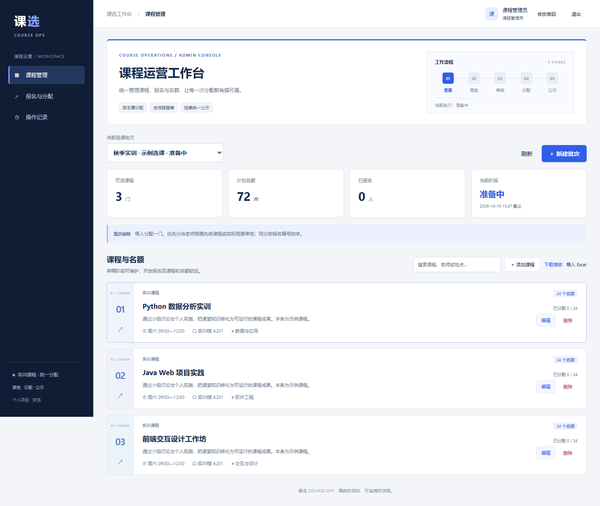
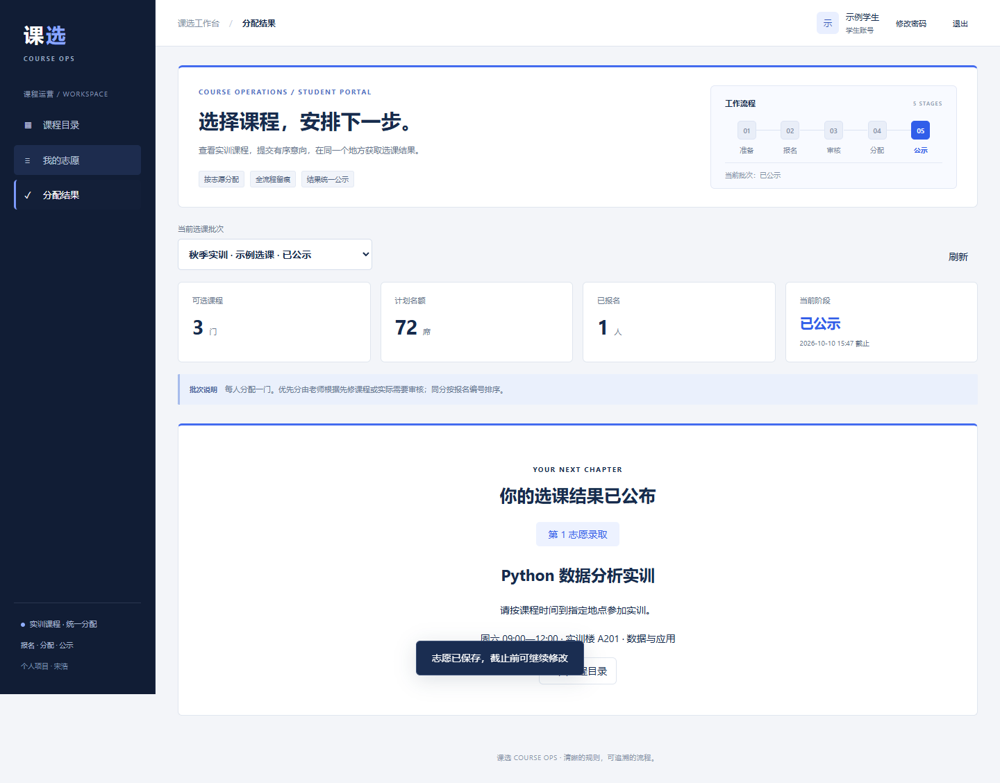

# 课选 · 实训课程选课与分配平台

**学生按兴趣排序，老师统一分配，让有限的实训名额有序落地。**

面向学院实训周、工作坊和限额选修活动的完整报名平台。学生填写最多六个课程意向，管理员维护课程名额与优先分，通过“优先分排序、遵循志愿、余量调剂”完成统一分配、公示与 Excel 交付。

个人维护项目 · Java 17 / Spring Boot / MyBatis / Vue 3 / EasyExcel / H2



## 一条完整的业务链路

| 学生 | 课程管理员 |
| --- | --- |
| 注册、登录和修改密码 | 首次启动生成管理员口令 |
| 浏览课程、搜索老师与地点 | 创建批次，维护课程、时间和容量 |
| 排序 1–6 个意向，选择是否接受调剂 | 下载 Excel 模板、批量导入课程 |
| 截止前修改或撤回报名 | 审核报名优先分、关闭报名 |
| 公示后查询自己的分配结果 | 运行分配、核对结果、公示与导出 |

**状态流转**：草稿 → 开放报名 → 关闭报名 → 已分配 → 已公示。服务端校验每一步；页面按钮并非唯一约束。

**分配规则**：优先分由管理员设置，默认 0；同分按首次有效报名编号排序。先按志愿匹配剩余名额，再对接受调剂的落选学生分配余量；每批每人最多一门。修改意向保留顺序，撤回后重新报名产生新顺序。管理员应在批次说明中提前公布优先分依据。

## 快速开始

需要 **Java 17**。发行包已包含 `dist/course-selection-platform.jar`，Windows 双击 **`启动系统.cmd`**。

从源码运行：

```bash
# Windows 使用 mvnw.cmd
./mvnw clean package
java -Duser.timezone=Asia/Shanghai -jar target/parallel-volunteer-admission-system-2.0.0.jar
```

打开 **http://127.0.0.1:8088**。默认使用 H2 文件数据库，无需安装 MySQL。

- 管理员账号：`admin`。
- 首次随机口令：本机 `data/admin-credentials.txt`；首次登录后可在账户设置修改。
- 学生自行注册；建议使用另一浏览器或隐私窗口体验学生端。
- 首次创建的四门课程明确标为示例，批次处于草稿状态，修改课程和截止时间后再开放报名。

管理员口令文件只用于本地初始化，修改口令后文件不代表新口令。不要公开数据库或该文件。

### Docker

```bash
docker compose up --build -d
```

访问 **http://127.0.0.1:8088**，首次口令与数据库位于本机 `data/`。容器默认仅映射本机端口；不要在未设置 HTTPS 和访问控制时直接暴露公网。

## 界面预览



## 工程实现

- Vue 3 静态工作台随 JAR 打包，前端依赖保存在仓库，运行时无需 CDN。
- Spring Boot 分层组织会话、课程、报名、分配和 Excel 接口；MyBatis 负责查询，JdbcTemplate 负责事务写入。
- 分配操作锁定批次记录；状态检查、结果写入、审计日志在事务内完成，拒绝重复分配。
- 原 `EnrollEngine` 算法保持不变，通过适配层把课程/报名映射成计划/志愿数据。
- PBKDF2 保存口令摘要、登录后更换会话 ID、CSRF Token 与同源检查；学生仅能查看自己的报名和已公示结果。
- Excel 全量校验后统一写入，失败回滚；限制文件大小与行数，导出处理公式注入字符。
- 默认 H2 + Hikari 文件存储，重新启动不会清空数据；可配置 MySQL 连接，迁移前需单独验收。

## 本地验证

2026-09-26：**18 项测试通过，1 项旧 MySQL 测试跳过**。包含 8 项规则测试与 10 项课程业务集成测试。浏览器实测完成管理员建批次、维护课程、学生报名、分配、公示、Excel 导出及手机适配。

```bash
./mvnw test
```

完整说明：[测试](docs/testing.md) · [操作手册](docs/user-guide.md) · [架构](docs/architecture.md) · [API](docs/api.md) · [数据模型](docs/data-model.md)

## 适用范围

可用于小规模单实例课程报名与统一分配。当前每批每人分配一门课，不处理学分规则、跨批次时间冲突、学校统一身份认证或候补自动递补；课程时间由管理员说明并由学生确认。它不是已对接学校生产教务系统的产品。

## 项目资料

- [来源与第三方组件](CREDITS.md)
- [许可证](LICENSE)

仓库地址保留历史名称 `parallel-volunteer-admission-system`；2.0.0 的运行入口和界面为课选平台。
