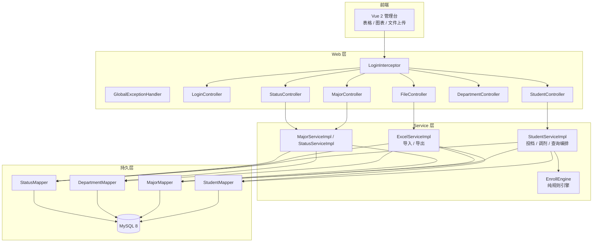
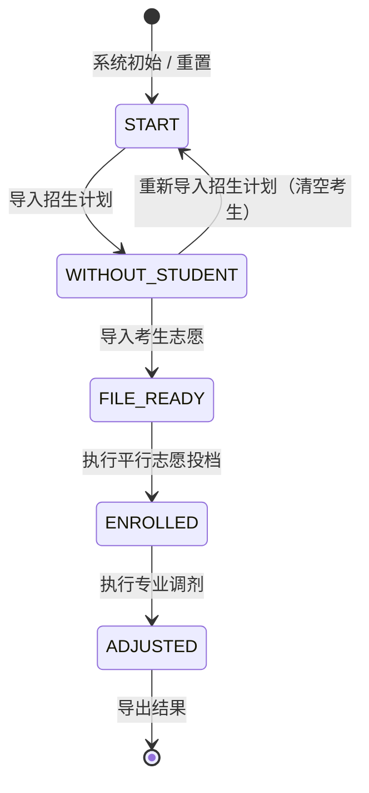
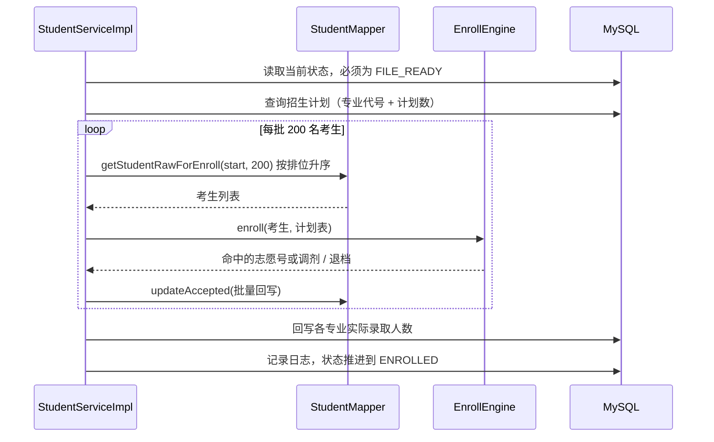
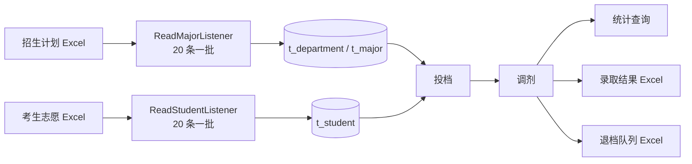

# 系统架构

## 分层结构

各层职责：

| 层 | 职责 | 说明 |
| --- | --- | --- |
| Controller | 参数接收、结果包装 | 只做参数校验与调用，不写业务规则 |
| Service | 业务流程编排 | 事务边界、分页、状态校验、调用规则引擎 |
| EnrollEngine | 投档与调剂规则 | 纯函数，不依赖 Spring 与数据库，可直接单测 |
| Mapper | SQL 执行 | XML 中的动态 SQL 与分页插件配合 |

## 录取状态机

状态保存在 `t_log` 的最新一条记录中，每一步都必须满足前置状态。

| 状态 | 序号 | 含义 |
| --- | --- | --- |
| `START` | 0 | 尚未导入任何数据，或已执行重置 |
| `WITHOUT_STUDENT` | 1 | 已导入招生计划，尚未导入考生志愿 |
| `FILE_READY` | 2 | 计划与志愿齐备，可以执行投档 |
| `ENROLLED` | 3 | 投档完成，可以执行调剂或导出 |
| `ADJUSTED` | 4 | 调剂完成，可以导出最终结果 |

## 考生录取状态

`t_student.accepted_type` 是结果字段，取值范围与含义：

| 取值 | 含义 |
| --- | --- |
| `-2` | 初始值，尚未参与投档 |
| `-1` | 退档（志愿全部落空且不服从调剂，或调剂缺额已用完） |
| `0` | 服从调剂，等待调剂 |
| `1` ~ `6` | 被第 N 个志愿录取 |
| `7` | 被专业调剂录取 |

## 投档流程

关键设计：

- **分页处理**：每批 200 条，避免一次性加载全部考生；`current` 按批推进，不回退。
- **内存计数**：投档过程中专业余额在内存中累加，最后一次性回写 `realistic_student_count`。
- **规则外置**：`EnrollEngine.enroll` 只负责「第一个有余额的志愿」，Service 不关心具体规则细节。

## 调剂流程

1. 查询所有 `plan_student_count > realistic_student_count` 的专业作为缺额池。
   查询使用 `LEFT JOIN`，保证**从未有人投档的专业**也能进入缺额池。
2. 按排位升序读取 `adjust = 1 AND accepted_type = 0` 的考生。
3. 依次把考生分配进缺额池，缺额池用完后剩余考生置为退档。
4. 回写专业实际录取人数与考生状态，状态推进到 `ADJUSTED`。

> 调剂分页读取时**不能推进偏移量**：被调剂的考生 `accepted_type` 由 0 变为 7，
> 会立刻从结果集中消失，推进偏移量会漏掉后续排位的考生。

## 数据流与文件

## 已知限制

- 状态依赖 `t_log` 最新记录，属于轻量实现；多实例部署时需要改为数据库状态表加乐观锁。
- 前端为已构建产物，仓库内不含前端源码工程。
- 投档与调剂在单事务中完成，数据量进一步增大时可改为分片事务 + 断点续跑。
