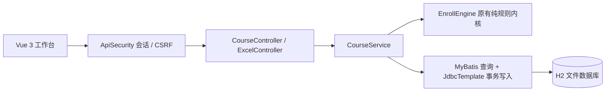

# 课选架构

入口只扫描 org.course 业务包。课程数据映射为 ExcelMajor，报名意向映射为 ExcelStudent，优先分降序与报名编号升序得到排位，交给原投档/调剂引擎。算法文件未改动，新的业务语义由适配层负责。

分配前 SELECT FOR UPDATE 锁定批次，检查 CLOSED 状态，在同一事务中写入结果、推进状态与记录审计。其他事务等待后读到已分配状态，不重复发放名额。Excel 先验证整个批次，再事务插入，避免半导入。

前端使用随 JAR 分发的 Vue 3，无需构建服务器或运行时 CDN。密码只保存 PBKDF2 摘要，登录后轮换会话 ID，修改密码使其他旧会话失效。写接口验证 CSRF 与来源；服务端区分 ADMIN/STUDENT，学生结果受账号和公示状态双重约束。

旧 org.enroll 控制器、XML、static/admission 和 SQL 是历史实现，未作为当前入口使用；不要用旧 schema.sql 初始化新平台。旧源码的授权信息仍见 CREDITS.md。
