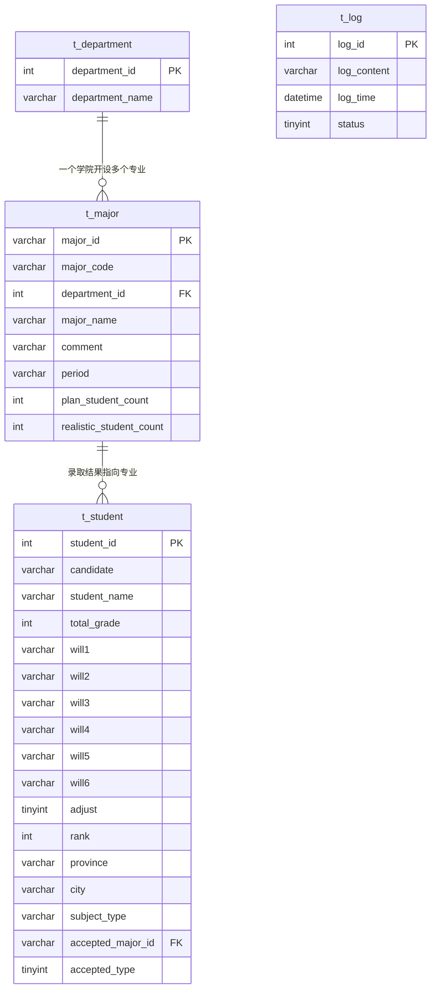

# 数据模型

## 表关系



## t_department 学院表

| 字段 | 类型 | 说明 |
| --- | --- | --- |
| `department_id` | int，自增主键 | 学院编号 |
| `department_name` | varchar(20) | 学院名称，导入时按名称去重 |

## t_major 招生计划表

| 字段 | 类型 | 说明 |
| --- | --- | --- |
| `major_id` | varchar(5)，主键 | 专业代号，考生志愿里填写的就是它 |
| `major_code` | varchar(10) | 专业代码（招生目录中的数字代码） |
| `department_id` | int，外键 | 所属学院，`ON DELETE CASCADE` |
| `major_name` | varchar(20) | 专业名称 |
| `comment` | varchar(255) | 专业备注 |
| `period` | varchar(255) | 学制年限 |
| `plan_student_count` | int | 招生计划数，投档的上限 |
| `realistic_student_count` | int | 实际录取人数，由投档与调剂流程累加 |

索引：`t_major_ibfk_1(department_id)`。

## t_student 考生志愿与结果表

| 字段 | 类型 | 说明 |
| --- | --- | --- |
| `student_id` | int，自增主键 | 考生记录编号 |
| `candidate` | varchar(12) | 准考证号 |
| `student_name` | varchar(255) | 姓名 |
| `total_grade` | int | 总分 |
| `will1` ~ `will6` | varchar(5) | 6 个院校专业志愿，保存专业代号 |
| `adjust` | tinyint | 1 表示服从专业调剂，0 表示不服从 |
| `rank` | int | 排位，数值越小排位越高，投档按它升序处理 |
| `province` / `city` | varchar | 生源地，用于生源地分布统计 |
| `subject_type` | varchar(10) | 科类（物理 / 历史等） |
| `accepted_major_id` | varchar(5)，外键 | 最终录取专业，退档时为 NULL |
| `accepted_type` | tinyint | 录取状态，取值见 `docs/architecture.md` |

索引：

| 索引 | 字段 | 作用 |
| --- | --- | --- |
| `idx_rank` | `rank` | 投档时按排位升序分页读取，避免全表排序 |
| `idx_mjr_rk` | `accepted_major_id, rank` | 按专业查询录取名单、计算专业最低排位 |
| `t_student_ibfk_1` | `accepted_major_id` | 外键，防止写入不存在的专业 |

## t_log 流程日志表

| 字段 | 类型 | 说明 |
| --- | --- | --- |
| `log_id` | int，自增主键 | 日志编号 |
| `log_content` | varchar(100) | 操作描述，例如「录取完成」 |
| `log_time` | datetime | 写入时间，默认 `CURRENT_TIMESTAMP` |
| `status` | tinyint | 操作完成后的流程状态 |

当前状态取「最新一条日志」：

```sql
SELECT status FROM t_log ORDER BY log_time DESC, log_id DESC LIMIT 1;
```

`log_time` 是秒级精度，同一秒内可能写入多条日志，因此必须叠加 `log_id` 作为次序依据。

## 建模说明

- 考生志愿直接保存专业代号而不是中间表，符合「一次导入、整体投档」的使用方式；
  代价是无法按志愿维度建外键约束，导入时由监听器保证专业代号在计划内。
- `plan_student_count` 与 `realistic_student_count` 放在同一行，投档时用 `WHERE plan > realistic`
  判断余额，天然避免超录。
- 退档考生保留在 `t_student` 中且 `accepted_major_id` 为 NULL，便于导出退档队列与复核。
